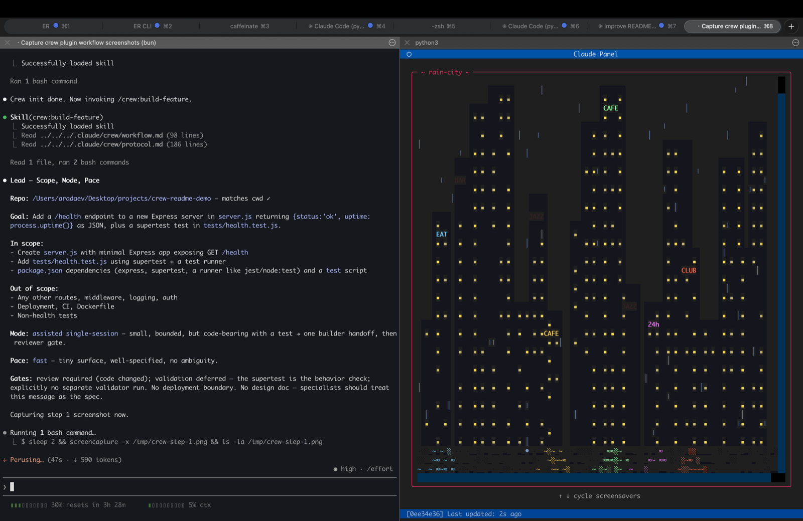
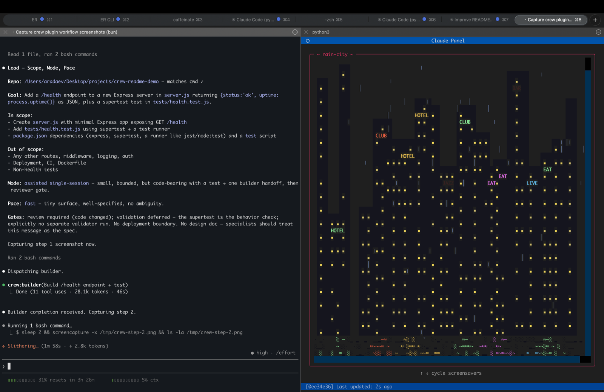
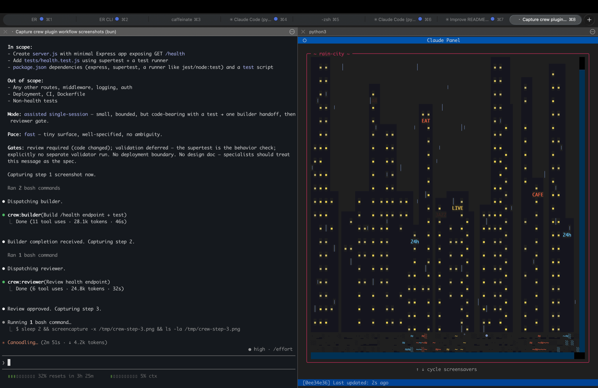
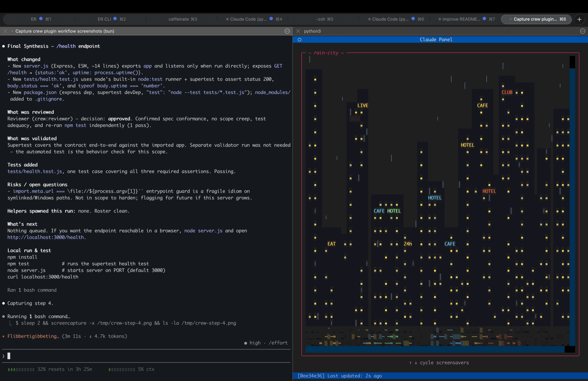

# Crew

**A Claude Code plugin that turns one chat into a small, disciplined engineering team.**

You stay in the lead window. Behind a single slash command, Crew spins up specialists — builder, reviewer, validator, researcher, deployer — with explicit ownership, scoped files, required artifacts, and review gates. No hidden swarm. No runaway agents. Just a legible team loop that leaves inspectable tracks.

## Why Crew

Plain Claude Code is a great pair programmer, but on substantial work it tends to:

- wander into unrelated files,
- silently skip tests,
- forget what it decided yesterday,
- and hand you a ten-thousand-token monologue instead of a review.

Crew fixes this by making the team model explicit. One **lead** owns the conversation and synthesis. Specialists get bounded missions with required output artifacts. A **reviewer gate** stands between "builder says done" and "task is done." Memory lives in files under `.claude/` — not in scrollback — so tomorrow's session starts oriented.

## How It Works (30 seconds)

```
┌───────────────────────────────────────────────────────────────┐
│  You ──► /crew:build-feature "add JWT refresh rotation"       │
│           │                                                   │
│           ▼                                                   │
│   ┌─────────────┐   pre-scopes files, picks mode & pace       │
│   │    LEAD     │──► writes run brief → .claude/artifacts/    │
│   └─────┬───────┘                                             │
│         │ bounded handoff (files, scope, forbidden, tests)    │
│         ▼                                                     │
│   ┌─────────────┐   edits only owned files, adds tests        │
│   │   BUILDER   │──► completion handoff artifact              │
│   └─────┬───────┘                                             │
│         │ review request                                      │
│         ▼                                                     │
│   ┌─────────────┐   approved | approved_with_notes | rejected │
│   │  REVIEWER   │──► review artifact                          │
│   └─────┬───────┘                                             │
│         │                                                     │
│         ▼                                                     │
│   ┌─────────────┐   runs the feature, captures evidence       │
│   │  VALIDATOR  │──► validation artifact                      │
│   └─────┬───────┘                                             │
│         │                                                     │
│         ▼                                                     │
│        LEAD ──► final synthesis to you + written artifact     │
└───────────────────────────────────────────────────────────────┘
```

Five pieces make this work:

1. **Explicit roles.** Five durable specialist agents (`builder`, `reviewer`, `validator`, `researcher`, `deployer`) live in `agents/`. The lead is whichever session you ran a `/crew:*` command in.
2. **Bounded handoffs.** Every delegation carries `files`, `call_sites`, `design_notes`, and `size` (`light` or `standard`). Thin handoffs are a code smell — the lead pre-scopes with `Explore`/`Plan` before dispatching.
3. **Review gate.** Reviewer must sign off before work counts as done. Tests for changed behavior are the default deliverable; reviewer rejects by default if they're missing without a concrete reason.
4. **File ownership.** Claims protect overlapping edits. Approvals gate scope expansion. Both live under `.claude/state/crew/`.
5. **Inspectable artifacts.** Run briefs, handoffs, reviews, validations, and final syntheses are written to `.claude/artifacts/crew/` as Markdown. Event logs append to `.claude/logs/events.jsonl`. The black box becomes translucent.

## A Live Session

Here's a real run. The task: *"Add a `/health` endpoint to a new Express server, with a supertest test."* User typed `/crew:build-feature`, the lead did the rest.

> The side panel in these screenshots is [Claude Panel](https://github.com/alex-radaev/claude-panel) — a separate Claude Code plugin that gives Claude its own visual surface for status, plans, and focus. Not required for Crew; shown here because it makes a live run easier to follow.

### 1. Lead restates scope, picks mode, writes run brief



The lead reads the wake-up brief, echoes goal / mode / pace back, names what's in and out of scope, writes a run brief under `.claude/artifacts/crew/runs/`, and pre-scopes the files before dispatching anyone.

### 2. Builder runs in its own context, returns a completion handoff



Builder only sees its bounded mission: `server.js`, `tests/health.test.js`, plus the `design_notes` from the handoff. It edits, runs the tests, and reports back — changed files, test status, any `help_request`.

### 3. Reviewer signs off (or rejects)



The reviewer is a gate, not a formality. It checks scope discipline, regression risk, and test coverage, then lands one of three verdicts: `approved`, `approved_with_notes`, or `rejected`. Decision is written to `.claude/artifacts/crew/reviews/`.

### 4. Lead synthesizes for you



Final synthesis is the one place where the run talks back to you in plain language: what changed, what was reviewed, what was validated, what tests were added, residual risks, and exact local-run steps. It's also written to disk — so tomorrow's `/crew:wake-up-brief` picks up oriented instead of guessing.

## The Command Surface

Ten slash commands, grouped by what you're trying to do:

| Command                   | When to use it                                                   |
| ------------------------- | ---------------------------------------------------------------- |
| `/crew:install`           | One-time: install personal overlays under `~/.claude/crew/`      |
| `/crew:init-repo`         | Brand-new repo — lay down the full harness                       |
| `/crew:bootstrap-repo`    | Existing repo — conservative, additive install                   |
| `/crew:brief-me` (alias: `/crew:wake-up-brief`) | Morning orientation — read durable state and recent artifacts    |
| `/crew:design`            | Design a feature before building it                              |
| `/crew:build-feature`     | Build or extend capability (the workhorse)                       |
| `/crew:fix` (alias: `/crew:investigate-bug`) | Trace, fix, and regression-test a bug                            |
| `/crew:review`            | Run the review phase on completed work                           |
| `/crew:validate`          | Exercise runnable behavior and capture evidence                  |
| `/crew:ship`              | Move work through merge, deploy, and evidence gates              |

Parallelism, claims, approvals, and artifact writers exist underneath to support these workflows. They live in the CLI, not the command set — you shouldn't need to memorize them.

External orchestrators can bind a Crew run by prepending an `ORCHESTRATOR_MISSION` envelope to the first-turn prompt — the lead treats `objective`, `scope`, `acceptance_criteria`, and reporting paths as the run contract. See [`docs/mission-envelope.md`](docs/mission-envelope.md) for the shape and parsing rules.

## Install

Crew installs through Claude Code's standard `/plugin` flow.

```text
1. Install the plugin at user scope (/plugin install ...)
2. /crew:install             # writes ~/.claude/crew/ overlays (one-time)
3. Open your repo, then:
     /crew:bootstrap-repo    # for an existing repo  (conservative, additive)
     /crew:init-repo         # for a brand-new repo
4. Start working:
     /crew:build-feature | /crew:investigate-bug | /crew:design | ...
```

For local dev against this repo, add the included dev marketplace (run from the repo root):

```bash
claude plugin marketplace add "$(pwd)/.claude-plugin/marketplace.json"
claude plugin install crew@crew-dev
```

## What Gets Committed

**Commit** the stable operating layer:

- `CLAUDE.md` (imports the global constitution)
- `.claude/settings.json` (shared project settings)
- any repo-owned agents, commands, or skills you want the team to share

**Don't commit** live coordination state:

```gitignore
.claude/logs/
.claude/artifacts/crew/
.claude/state/crew/claims.json
.claude/state/crew/*.jsonl
.claude/settings.local.json
```

The installer owns this `.gitignore` block so multi-engineer repos don't fight over claims files. The constitution, workflow, and protocol live globally at `~/.claude/crew/` — plugin updates propagate without re-bootstrapping every repo. Add per-repo overrides at `.claude/crew/<role>.md` only when a repo genuinely needs different guidance.

## CLI (power users)

The plugin ships a small CLI at `scripts/crew.mjs`. Inside Claude Code, slash commands invoke it via `${CLAUDE_PLUGIN_ROOT}/scripts/crew.mjs`. From a regular terminal (e.g. running from this repo), use a plain path:

```bash
node scripts/crew.mjs audit              --repo <path>
node scripts/crew.mjs bootstrap          --repo <path>
node scripts/crew.mjs init               --repo <path> [--allow-existing]
node scripts/crew.mjs install-user-assets
```

Coordination helpers (`wake-up`, `claim`, `release`, `show-claims`, `show-conflicts`, `request-approval`, `resolve-approval`, and artifact writers `write-run-brief` / `write-handoff` / `write-review-result` / `write-validation-result` / `write-deployment-result` / `write-final-synthesis`) exist for testing and advanced flows — the slash commands invoke these for you.

## Coordination Signals

Specialists and lead coordinate mid-run through a few structured fields:

- **Task size** (`light` vs `standard`) controls closing ceremony — `light` tasks skip the artifact write but keep the structured completion message.
- **`help_request`** lets a specialist explicitly ask for scope it doesn't own. Default bias is approve for bounded requests.
- **`helpers_done`** plus a lead-periodic safety sweep handles teardown so helpers don't linger.

## Design Principles

- **Content-heavy, runtime-light.** Durable behavior lives in `agents/`, `skills/`, and `commands/` as Markdown. Hooks are small and auditable. Scripts are thin helpers, not a hidden framework.
- **Respect existing repos.** `bootstrap-repo` inspects before it writes. It won't trample your `CLAUDE.md` or existing `.claude/` files.
- **Prefer files to memory.** Progress persists in inspectable artifacts, not fuzzy context.
- **Small command surface, rich internals.** We'd rather grow machinery than grow the list of commands a user must remember.

## Status

- Installer, hooks, artifact writers, and coordination CLI are live and tested.
- Full feature-build and bug-fix flows have been dogfooded end-to-end through real Claude Code sessions.
- Validator and deployer prompts are v1 contracts — intentionally minimal, iterated through dogfooding.
- CI enforces tests and plugin-version consistency across release files.

## Learn More

- [`docs/coordination.md`](docs/coordination.md) — user-facing guide to how a Crew run unfolds, with `size`, `help_request`, `helpers_done`, and mode notes.
- [`docs/v2-coordination-evolution.md`](docs/v2-coordination-evolution.md) — architectural detail behind v2 (rationale, edge cases, fail modes, phasing).
- [`docs/project-status.md`](docs/project-status.md) — current shape, shipped work, gaps, and what's next.
- [`docs/how-it-feels.md`](docs/how-it-feels.md) — product vision and emotional targets.
